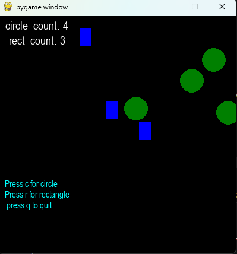

# MY FIRST PYTHON PYGAME PROGRAM!!!

### How to Run
Hit CTRL+S

Click the run button or in the terminal type python and the file name
### Features

Can make circles and rectangles in your favorite color

Can place the shapes randomly

Has a count for each of the both shapes

### Here is a picture of my program

